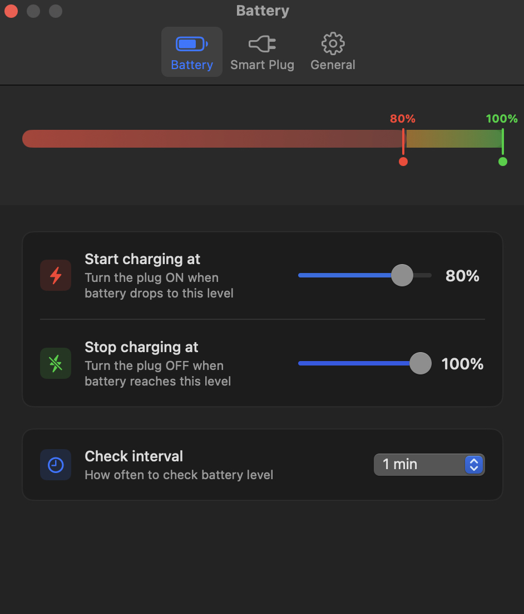
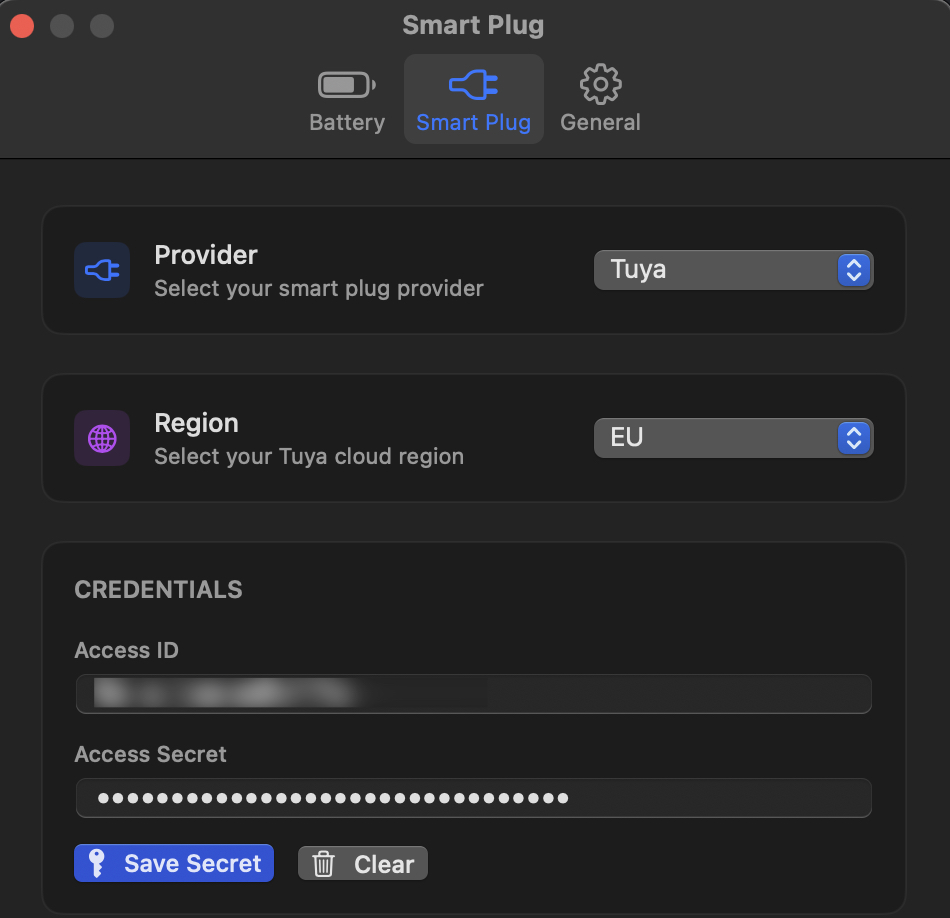
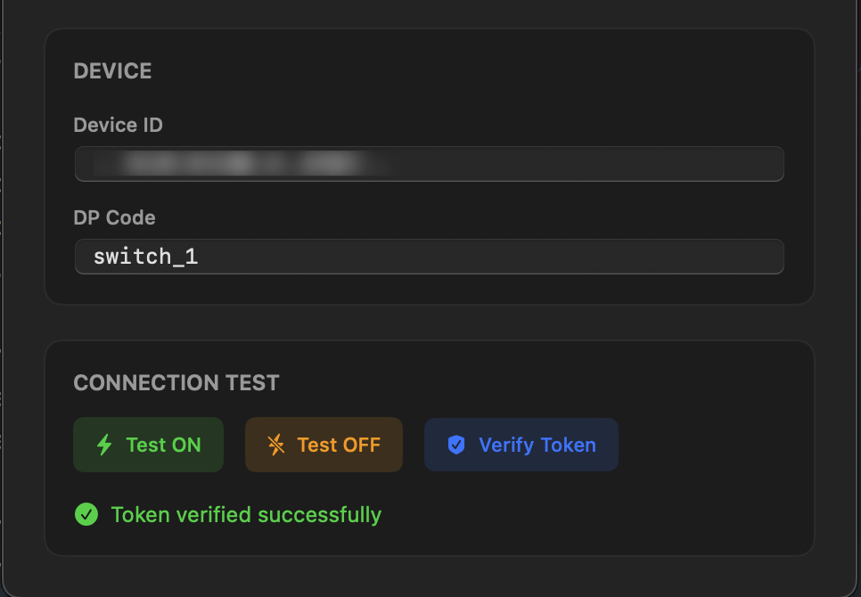
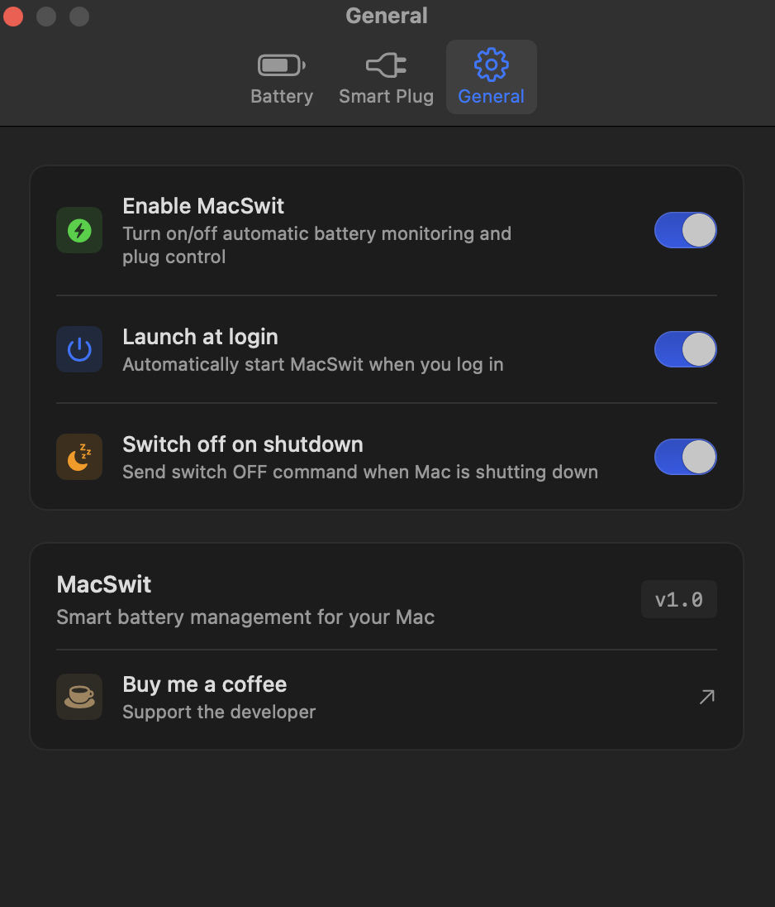

## MacSwit

Menu-bar utility that watches your Mac's battery level and toggles a smart plug (only Tuya/Tupa-compatible supported for now) on or off to keep the machine within a configurable charge window.

**Runtime loop (step-by-step)**
1. `MacSwitApp` launches, performs preference/keychain migrations, and instantiates a shared `AppState`. It also wires the menu-bar extra icon to show the latest plug state.
2. `AppState` loads persisted thresholds, polling interval, provider choice, and login preference through `@AppStorage`, then obtains the active `SmartPlugProvider` instance from `ProviderRegistry`.
3. A repeating `Timer` (minimum 60 seconds) calls `performCheck`, which runs `BatteryReader` off the main thread to obtain the most recent percentage from IOKit or `pmset` as a fallback.
4. `AppState.evaluateBattery` compares the reading to the configured on/off thresholds, ensures `On < Off`, and enforces a ~3 minute hysteresis window so the plug is not spammed with duplicate commands.
5. When an action is needed, `AppState` asks the current provider to send `on`/`off`. The Tuya provider reloads its configuration from `UserDefaults`, pulls the Access Secret from the login keychain (`MacSwit.tuya.accessSecret`), and validates that mandatory fields are non-empty.
6. `TuyaProvider` builds a `TuyaClient.Configuration`. The client lazily fetches a token via `/v1.0/token`, caches it until one minute before expiry, verifies the smart plug is online, and signs REST calls using the helpers in `Helpers/CryptoHelpers.swift` before calling `/v1.0/iot-03/devices/{deviceId}/commands`.
7. UI surfaces (`MenuView`, `SettingsView`, `TuyaSettingsView`) observe `AppState` to reflect battery state, the latest command, manual "Check Now" actions, and on-demand **Test ON/OFF** or **Verify Token** operations.
8. Supporting services such as `SettingsMigration` (legacy key migration) and login-item synchronization via `SMAppService` keep older installs working and respect the **Start at login** toggle.

### Requirements
- macOS 13.0+ (Menu Bar Extra + login-item APIs) running from a signed `.app` bundle for login-item support.
- Xcode 15+ / Swift 5.9 toolchain.
- Tuya/Tupa developer account, cloud project, and device already paired to that project.
- Tuya/Tupa API credentials: Access ID, Access Secret, region endpoint (EU/US/CN or custom), device ID, and optional DP code (defaults to `switch_1`).

### Building & Running
1. Open `MacSwit.xcodeproj` in Xcode and select the **MacSwit** scheme.
2. Ensure the signing team is set for the main target so the app can request login-item privileges.
3. Build & run. The app appears in the menu bar and shows the current battery percentage as its title.

### Configuration
1. Open **Settings…** from the menu-bar UI.
2. Battery tab: set the lower/upper thresholds (plug turns **ON** at/below the lower bound and **OFF** at/above the upper bound). Keep `On < Off`; the controls enforce a 5% gap.

   
3. Smart Plug tab: pick the provider (currently Tuya/Tupa) and select a region endpoint or **Custom** host to match your cloud project’s data center.
4. Fill in Access ID, Access Secret (stored securely in the login keychain when you hit **Save Secret**), Device ID, and an optional DP code (`switch_1` for most one-gang plugs). Re-saving credentials clears cached API tokens automatically.

   

   

5. Use **Test ON/OFF** to verify the relay reacts, and **Verify Token** to ensure authentication works before enabling automation.
6. General tab: enable **Start at login** when running from a signed `.app`. macOS will prompt for approval the first time.

   

### Tupa (Tuya) API Data for Settings
Follow these steps to grab each field the Settings screen requires. The wording in the Tuya IoT Platform (a.k.a. Tupa developer console) occasionally changes, but the flow stays consistent:

1. **Create and configure a cloud project.** Sign in to the Tuya/Tupa IoT Platform, open **Cloud › Development**, and create a project in the same data center (EU/US/CN/Other) where your hardware resides. Under **Authorization Management**, enable at least *Device Status*, *Device Control*, and *Token Service* APIs.
2. **Link the mobile app that owns the plug.** In the project’s **Link Tuya App** section, scan the QR code with the Smart Life or Tuya Smart app that controls the plug. This step ties your consumer devices to the cloud project so API calls can see them.
3. **Access ID & Access Secret.** Inside the cloud project dashboard, open **Authorization Key** (sometimes labelled *Project Configuration*). Copy the `Access ID` (client_id) and `Access Secret` (client_secret). Paste the ID in MacSwit, then click **Save Secret** to store the secret in the keychain. Rotate secrets in the console if needed, then save them again in MacSwit to invalidate old tokens.
4. **Device ID.** Pair the plug in the Smart Life/Tuya Smart app first. Back in the IoT Platform, go to **Devices › All Devices** within your project and copy the device’s 20+ character ID. You can also call the Tupa API (`GET /v1.0/iot-03/devices` or `GET /v1.0/iot-03/devices/{device_id}` in API Explorer) to list IDs if you prefer working directly with the API.
5. **DP code (function code).** Open the device detail page in the console and choose **Standard Instruction Set** (a.k.a. Functions). Note the code for the relay you want to control—most plugs expose `switch_1`, while multi-gang plugs list `switch_2`, etc. The same info can be fetched via `GET /v1.0/iot-03/devices/{device_id}/functions`.
6. **Endpoint / Region host.** Match the host in MacSwit to your project’s data center and cloud vendor:
   - China Data Center (Shanghai · Alibaba Cloud) → `openapi.tuyacn.com`
   - Western America Data Center (Oregon · AWS) → `openapi.tuyaus.com`
   - Eastern America Data Center (Virginia · Microsoft Azure) → `openapi-ueaz.tuyaus.com`
   - Central Europe Data Center (Frankfurt · AWS) → `openapi.tuyaeu.com`
   - Western Europe Data Center (Amsterdam · Microsoft Azure) → `openapi-weaz.tuyaeu.com`
   - India Data Center (Mumbai · AWS) → `openapi.tuyain.com`
   - Singapore Data Center (Singapore · Alibaba Cloud) → `openapi-sg.iotbing.com`
   - Other regions or private gateways → choose **Custom** and enter the hostname provided by Tuya/Tupa.
7. **Test via API Explorer (optional but recommended).** Before switching back to MacSwit, use the IoT Platform’s API Explorer to call `GET /v1.0/token`, `GET /v1.0/iot-03/devices/{device_id}` (to confirm the device reports `online: true`), and `POST /v1.0/iot-03/devices/{device_id}/commands` with `{ "code": "switch_1", "value": true }` to ensure your project has the correct permissions.
8. Enter the collected values in MacSwit’s Smart Plug tab, tap **Save Secret**, and run the built-in test buttons. Once both tests succeed you can rely on the automatic battery-driven loop.

### Behavior Notes
- Battery readings use IOKit when available and fall back to `pmset -g batt`.
- A hysteresis window prevents repeated commands within ~3 minutes for the same action.
- Tuya tokens are cached until ~1 minute before expiry; changing credentials clears cached tokens automatically.
- Access secrets live in the login keychain entry `MacSwit.tuya.accessSecret`. Clearing the secret field removes it and forces a fresh login on the next API call.

### Login Item Troubleshooting
- The login-item toggle only works when running the fully signed `.app` bundle (e.g., archive or `Product › Build` then launch from Finder). Xcode’s preview host is not sufficient.
- Ensure the **Start at login** capability is enabled for the target and the app is signed with a Developer ID or Personal Team.
- After first launch from the signed app, macOS 13+ may show a prompt in **System Settings › General › Login Items**; approve MacSwit there if registration initially fails with “Operation not permitted.”

### Testing
- The repository currently includes empty unit/UI test targets. Add coverage for threshold validation, Tuya request signing, battery parsing logic, and high-level SwiftUI flows before shipping production builds.
